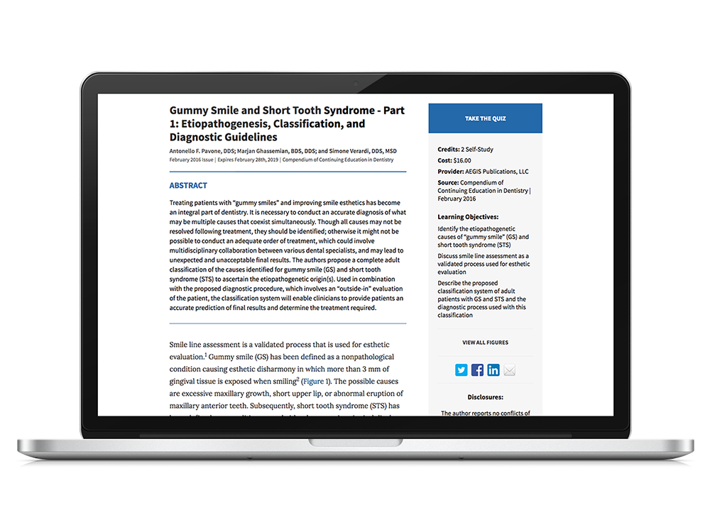
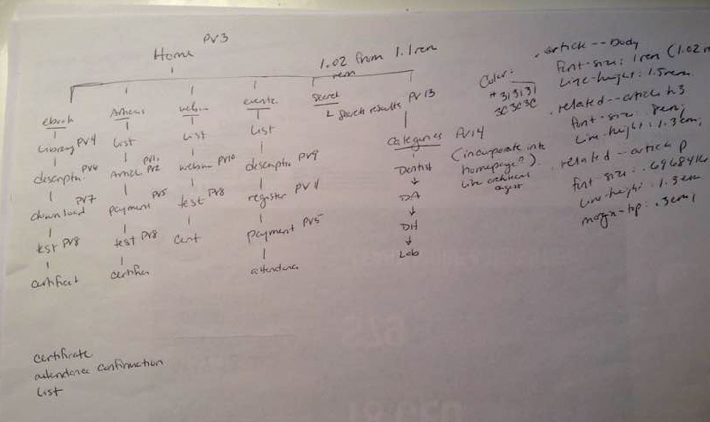
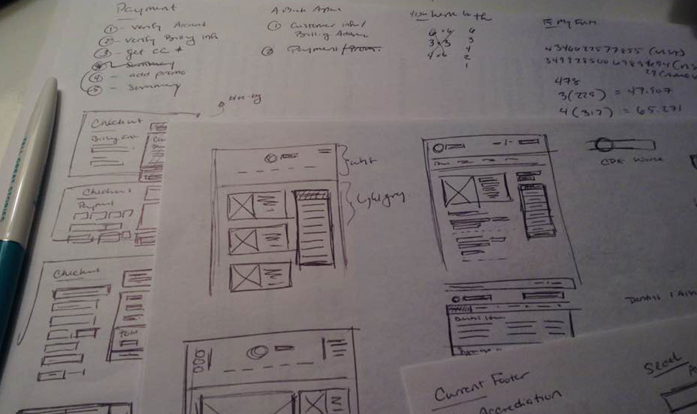
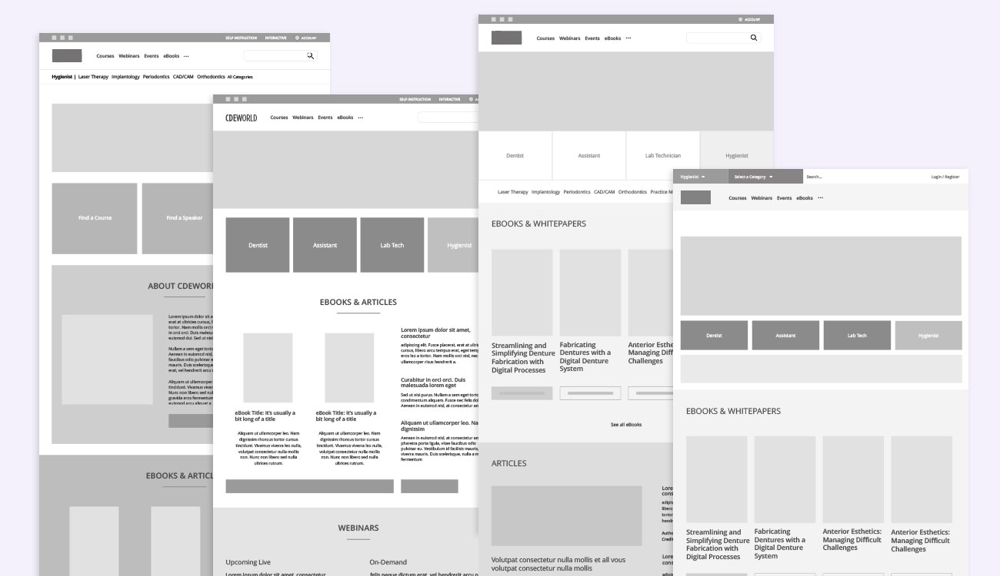
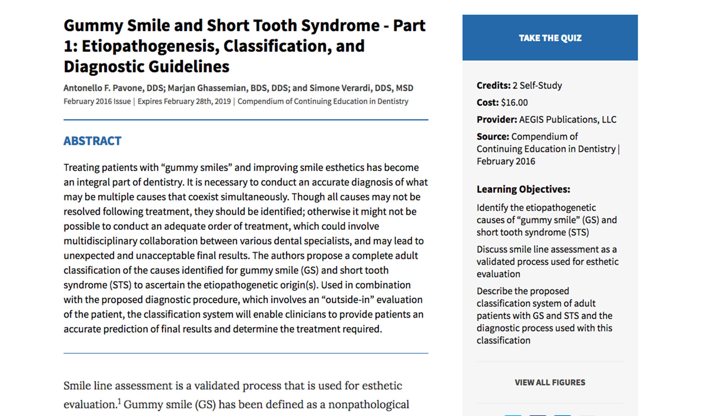
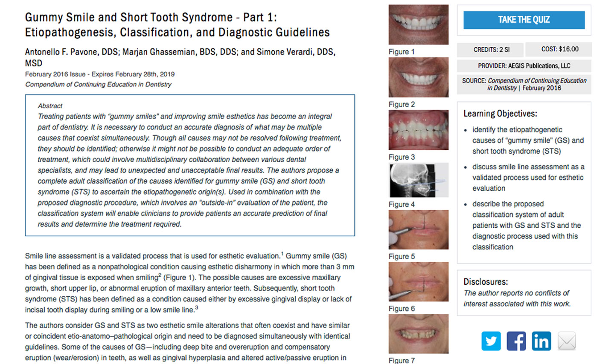

## THE APPROACH

An audit and refractor of the website's code would help to improve the performance of the site and give a responsive design that the website is currently lacking consistently. A better integration of their values would be deeply entwined with solutions to make a cleaner and more user-friendly design.

## RESEARCH

I needed to find out where the problems in the site were. I needed many questions answered — what pages were performing well or poorly, finding out what changes needed to be made, did the layout of the site need an overhaul, did any sections need to be added or removed, were users getting stuck on certain areas, etc.

To answer some of these questions I used Ptengine and utilized their heat maps for 4 months to get a good median of data. Using heat maps to track customer movement on the website; their engagement with the pages and interface interactions; and their movement down the page.

**Biggest takeaways:** The site was getting more mobile traffic than expected. There were aspects of the site that were confusing to people, people were clicking on unclickable objects. Any page with a list was using an infinite scroll and having a sharp drop in people scrolling. The screen resolutions that were recorded on the site were larger than the design was originally created.

Sketches identifying general site structure, the type of pages that would be needed, and their connection to other pages. Also some rough sketches of the site pages.

## SITE MAPPING

Before I started on the wireframes I brokedown the site to visualize the different types of pages and their relations to one another. This site was going to have dynamically generated pages, I knew I needed the types of pages versus the sheer amount of them.

Going down through the navigation I traced the links to the pages that they touched. Many pages inevitably would go to similar pages, such as payment, descriptions, certifications, or lists. I was then able to prioritize and group the types of layouts that were necessary.

## WIREFRAMES

Utilizing the takeaways from heat maps, information from the sitemap, and conversations with decision makers I started making numerous wireframes for the homepage and other pages. I took inspiration and ideas from content heavy websites similar in content to CDEWorld, much like a newspaper or news site. I needed a look capable of holding a lot of text similar to the sites of New York Times, Reuters, or Washington Post.

Examples of constant iteration — Various wireframes for the homepage trying to figure out what content works best were.

## PROTOTYPES

The various pages would have different layouts, depending on their content and one of the toughest was the homepage. After creating many different designs, I quickly went to prototyping the layouts to get a feel for how they would function. It helped to quickly work through many ideas, different points of emphasis, and generally working through the problem.

<a class="inline-link" href="https://toripugh.com/prototype/cdew-test-v1/Grid-%20Redesign-3/Grid%20-%20Test3.html" target="_blank">Homepage - Ver1</a>
<a class="inline-link" href="https://toripugh.com/prototype/cdew-test-v1/Grid-%20Redesign/Grid%20-%20Test.html" target="_blank">Homepage - Ver2</a>
<a class="inline-link" href="https://toripugh.com/prototype/cdew-test-v1/Homepage.html" target="_blank">Homepage - Ver3</a>
<a class="inline-link" href="https://toripugh.com/prototype/cdew-test-v1/hp2/" target="_blank">Homepage - Ver4</a>
<a class="inline-link" href="https://toripugh.com/prototype/cdew-test-v1/hp3/" target="_blank">Homepage - Ver5</a>
<a class="inline-link" href="https://toripugh.com/prototype/cdew-test-v1/hp4/" target="_blank">Homepage - Ver6</a>
<a class="inline-link" href="https://toripugh.com/prototype/cdew-test-v2/Prototype-Version3.html" target="_blank">Homepage - Ver7</a>
<a class="inline-link" href="https://toripugh.com/prototype/cdew-test-v1/Grid-%20Redesign-2/Grid%20-%20Test2.html" target="_blank">Ebook Library - Ver1</a>

Creating a cleaner and easier reading experience on the articles.

## THE IMPORTANT PAGES?

I started this project on what I thought was the most important page, the homepage. Looking back at the heat maps I realized that people weren't really spending as much time there and the real experience were on secondary pages such as the articles, webinars and events. These pages are the **real objective** of visitors to the site.

I wanted to make the experience on these pages more user-friendly. The main objectives were making the text more legible, simplifying the experience, build with responsive in mind and speeding up page load.

The purpose of these pages is to read or watch the information and then pass a test for certification. With this in mind I made a prototype that emphasized the main content, whether that is an article; ebook; event; or webinar, and includes a sidebar with the educational material or a sidebar like text area with the important information.

<a class="inline-link" href="https://toripugh.com/prototype/cdew-test-v2/Prototype-Version1.html" target="_blank">Article Page - Ver1</a>
<a class="inline-link" href="https://toripugh.com/prototype/cdew-test-v2/Prototype-Version5-B.html" target="_blank">Checkout - Ver2</a>
<a class="inline-link" href="https://toripugh.com/prototype/cdew-test-v2/Prototype-Version10.html">Webinar Page - Ver1</a>
<a class="inline-link" href="https://toripugh.com/prototype/cdew-test-v2/Prototype-Version6.html">Ebook Description - Ver1</a>
<a class="inline-link" href="https://toripugh.com/prototype/cdew-test-v2/Prototype-Version9.html">Event Page - Ver1</a>
<a class="inline-link" href="https://toripugh.com/prototype/cdew-test-v2/Prototype-Version11.html">Event Registration - Ver2</a>

## ~~ONGOING PROJECT~~

I left before the project was finished. I'd made 14 different pages that correspond to areas on the site map. These go through the drip down process of the visitor flow in the content funnel. I chose to concentrate on the main parts of the page and left the footer and header out for the moment. They are two hardest parts of this endeavor, there is so much information that is required.
