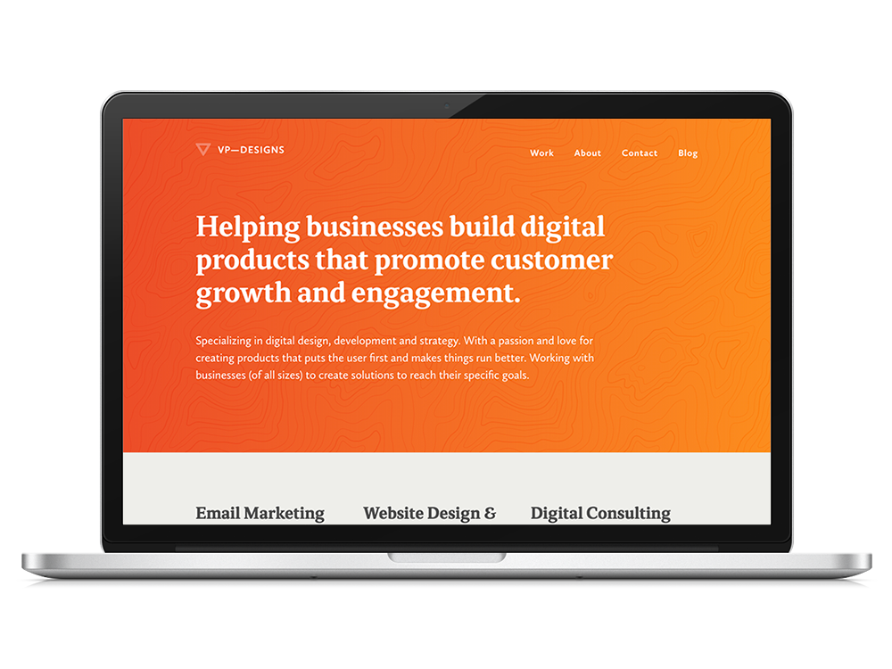
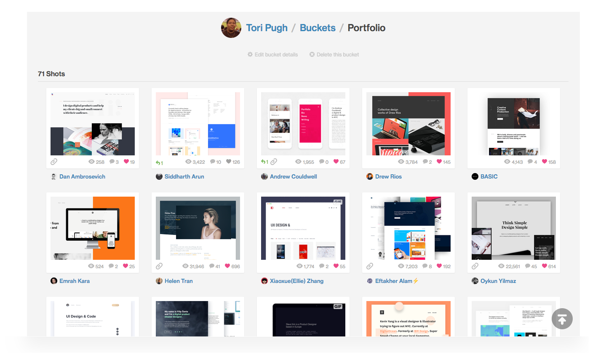
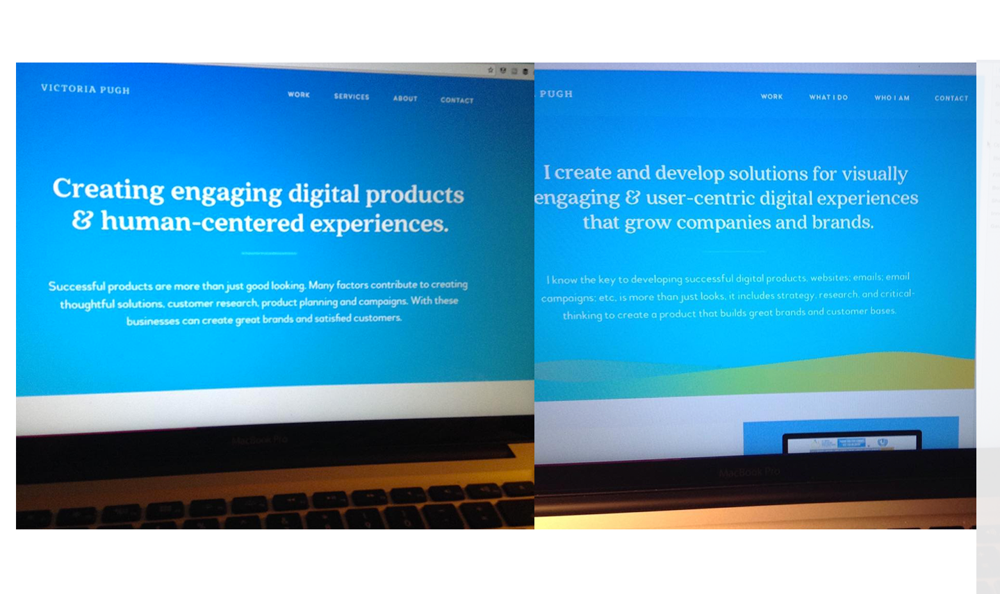
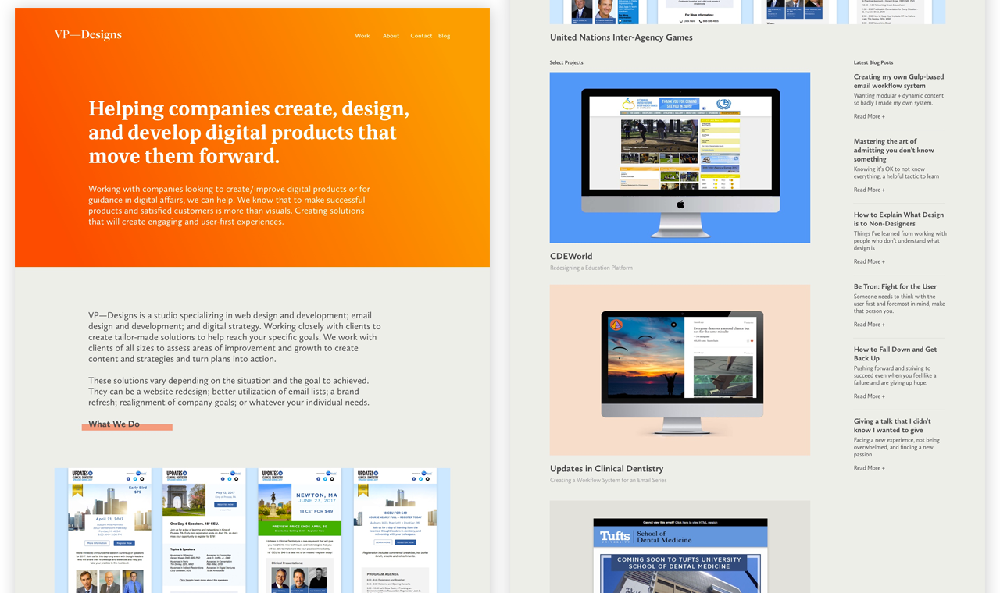
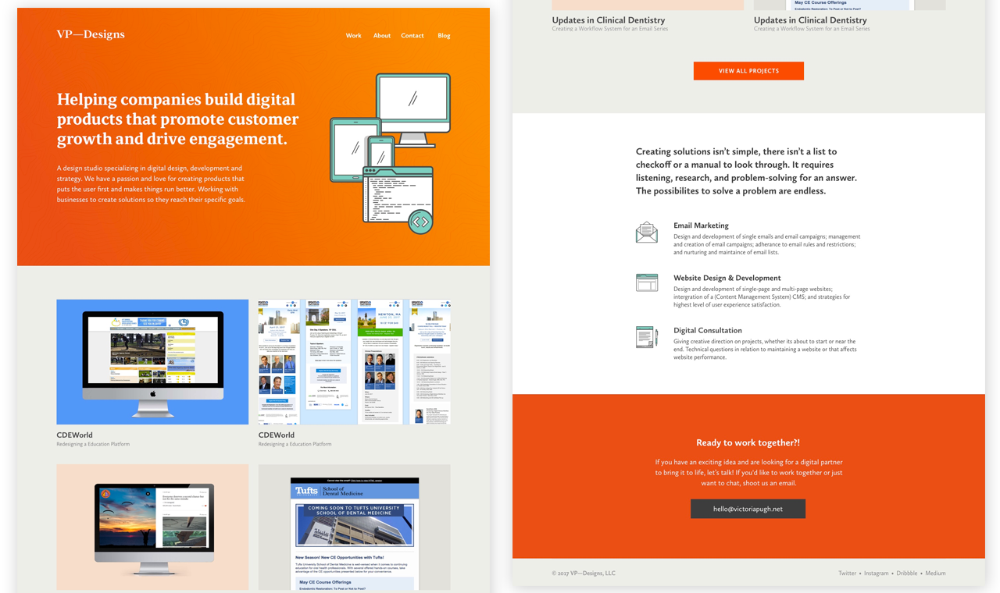
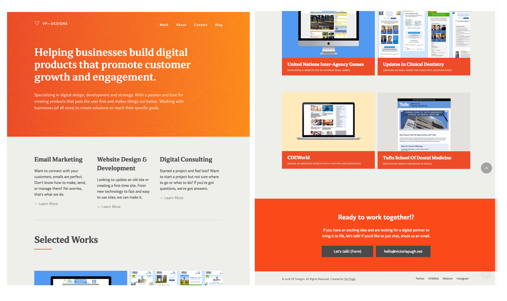

## THE APPROACH

Creating a site that speaks to clients while educating and coaching at the same time is a difficult feat. I wanted the site to be easily accesible to anyone looking to fix a problem or looking into my company. I didn't want to use jargon or confusing terms.

I would be tasked with all facets of this project, copywriting, design, and developing. I wanted to stress speed in the website, a quick start up and download of the components. The design I wanted to be simple but with a bit of flare, to be eye-catching and rememberable. The copywriting would be another matter but I'd do my best.

## RESEARCH

I poured over Dribbble and went through as many portfolio sites as I could, each being exceptionally different. Not finding a style that I thought I wanted my site to go in, I took different pieces of design techniques and incorporated them into my ideas.

I curated an extensive list of portfolio sites. Not necessarily to emulate but to gather ideas about font-size, layouts, and general appearance.

### LAYOUT

This was something that I thought about a lot. There was a rise in single page sites and I wasn't sure if that was a direction to go into. For potential clients I wasn't sure if that'd be easier to navigate or if they'd prefer the standard back and forth of different pages.

### COLOR SCHEME

I've always used 3 colors as my scheme, they have significance to me. This time around I wanted to do a nice gradient for the homepage hero, something that would grab attention. Not too flashy though, subtle enough to straddle the line.

### CONTENT

The most important thing I wanted to gain from looking at all these sites was an idea of how to present my content. I looked to local or non-high profile people to see how they displayed and talked about their work. They were name building and I wanted to follow their lead more then well known names.

## INITIAL DESIGNS

I jumped into sketch and started to put together some layouts and start working with the proper wording. I wanted to make the homepage intial screen simple and impactful. Going with the idea of gradients I wanted the hero to be a bright color with simple white text.

I went to the extreme at first and worked my way back to a more clean design. The waves at the bottom were more distracting than they actually added anything to the site. The wording was too much, you want people to hit the page and want to read more and not be hit by a wall of words, in most cases.

I didn't feel these designs were strong enough. The text alignment felt off and the wording was quite right. Just had to keep subtracting.

## DESIGN #2

I'd developed the prior designs into a prototype site, and was not satisfied with the layout and the wording. Back at square one, I wanted something different from some of the sites I'd seen. I kept with my font choice of primarily sans-serif font with an bold serif font. I also went to left align instead of center aligning.

After personally working through some other branded related decisions, I was also moving with my improved identity. Associating as a company I changed from using my name, Victoria Pugh, to VP—Designs. This also warranted a change in how some pages would be laid out and how I'd be referring to myself.

More dynamic gradient, liked the heavier font choice, and less to read. On the right direction.

## FURTHER ITERATION

Worked on cultivating a good brand tone and trying to keep stripping back until there was a good balance. I wanted to balance the flash, minimalism, and color.

Looking through a lot of Steve Schoger's tweets on <a href="https://twitter.com/steveschoger/status/895647278370660353">gradients</a> and <a href="https://twitter.com/i/moments/880688233641848832">more</a> and used that to create a much cleaner and more consistent colored site. My gradients now felt vibrant and balanced. I liked the usage of the icons in the hero and in the list below.

Following online tips I made a more streamlined site. The tone feels much more natural. Everything looked more balanced.

## FINAL VERSION

The final site, is very close to the previous design. As much as I liked the icons, I think the site looks perfectly fine without them. I added slight patterns behind the gradients on the hero, these are tied to the different colors. It's a part of the branding that I've created for the company and works very well on the web. There are SVGs that are inlined so there is no extra weight or strain to the site. They are also quite easy to manipulate if I want to change them further on down the road.

The build for this site is very simple, it's just your average HTML, CSS, and Javascript. The only fancy thing I've done is lazy-loading the images and used srcset. This reduces the burden on mobile and tablet users and let's them load a smaller sized file.

The blog page was a late addition because I had not decided to write a consistent blog until late in the development phase. It was easy but it's a very manual process at the moment and making that easier would be great.

